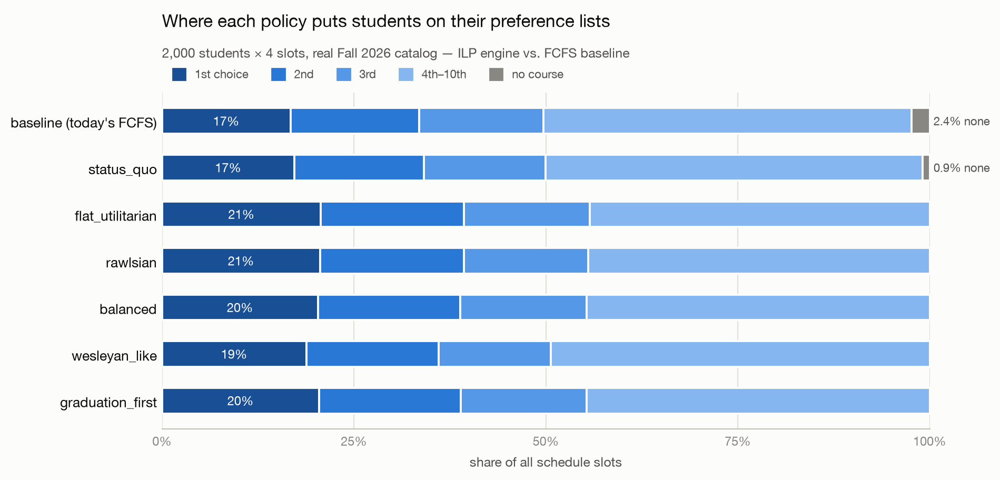

# Registration Optimizer

A course-registration allocation engine built on real Middlebury College
data, designed around one idea: **there is no single "best" registration
algorithm — who gets priority is an institutional value judgment, so it
should be configuration, not code.** A `Policy` object holds the
"sliders" a registrar or IT department would set; two independent
mechanisms consume the same policy and can be compared head-to-head.



## The sliders

| Slider | The institutional question |
|---|---|
| `class_year_weights` | Do seniors' preferences count more, and by how much? |
| `priority_mode` + `tier_order` | Is seniority a thumb on the scale, or a hard gate (seniors fully placed before juniors are considered)? |
| `equality` | The dial from "minimize total dissatisfaction" (0) to "judge only by the worst-off student" (1, Rawlsian) |
| `requirement_weight` / `guarantee_requirement` | Priority for courses **required for a student's major — across departments** (an econ major needs intro math) |
| `major_match_bonus` | An edge for majors in their own department's courses |
| `past_outcome_weight` | Compensation for students the system served badly last term |
| `seat_bins` | Wesleyan-style per-course seat reservations by class year / major |
| `rank_cost_exponent`, `unassigned_penalty`, `k`, `seed` | How much worse the deep list is, the cost of an empty slot, schedule size, lottery reproducibility |

A policy is just JSON — see [`policies/`](policies) for six presets
(`status_quo`, `flat_utilitarian`, `rawlsian`, `balanced`,
`wesleyan_like`, `graduation_first`).

## The two mechanisms

- **ILP engine** (`regopt/policy_ilp.py`) — integer linear programming
  (PuLP/CBC): the centrally optimal allocation for a given policy.
- **Deferred acceptance** (`regopt/deferred_acceptance.py`) —
  Gale-Shapley-style stable matching, where the *course-side priority
  order* is derived from the same policy. Harder to game, per Diebold,
  Bichler, Matthes, Schneider & Aziz (2014), ["Course Allocation via
  Stable Matching," BISE 6(2)](https://aisel.aisnet.org/bise/vol6/iss2/5/).

A first-come-first-served simulation of today's system
(`regopt/baseline.py`) anchors every comparison, and a neutral,
policy-independent metrics harness (`regopt/metrics.py`) scores all
of it on one scale.

## Headline results (2,000 synthetic students, real Fall 2026 catalog)

- Today's seniority-gated FCFS leaves first-years with **2.5× the average
  cost** of seniors (27.6 vs 11.2) and its worst-served student near
  total shutout. Removing the gate improves *everyone in aggregate* —
  average cost falls 16.5 → 14.0 and every schedule fills.
- Rawlsian fairness is nearly free on this data: the worst case improves
  26 → 21 for +0.01 average cost, saturating by `equality=0.25`.
- The `graduation_first` policy gets **100%** of students who ranked a
  course required for their major into one (vs 75% when unprioritized),
  including cross-department cases.
- Stability has a measurable price: deferred acceptance costs ~+2.9
  average vs the ILP under identical policies, and roughly halves
  justified-envy pairs relative to FCFS.

Full reasoning, a line-by-line code walkthrough, and all verification
numbers: **[POLICY_ENGINE_EXPLAINED.md](POLICY_ENGINE_EXPLAINED.md)**.

## Quickstart

```bash
python3 -m venv venv && source venv/bin/activate
pip install -r requirements.txt

python main.py                                  # all presets × both engines (~10 min)
python main.py --preset rawlsian --engine ilp   # one policy, one mechanism
python main.py --policy policies/balanced.json --limit 400   # quick, smaller run
python main.py --engine ilp --chart figures/rank_distribution.png
```

## Repository map

```
data/                 real Fall 2026 Banner export + derived CSVs, synthetic
                      students/preferences, invented major-requirement map
preprocessing/        re-runnable scripts: Banner JSON → CSV, synthetic
                      prior-term outcomes, major requirements
regopt/               the package: models, loaders, graphs, FCFS baseline,
                      Policy + presets, both engines, metrics, chart
policies/             the six presets, serialized — the files an IT
                      department would actually edit
main.py               CLI comparison runner
figures/              generated charts
```

## Data honesty

The course catalog (1,834 sections, capacities, meeting times) is a real
Middlebury Fall 2026 export. The 2,000 students, their preferences, the
`prior_avg_rank` column, and `data/major_requirements.csv` are synthetic
inventions with realistic shape, disclosed as such in the scripts that
generate them — this is a modeling study, not registrar data.
